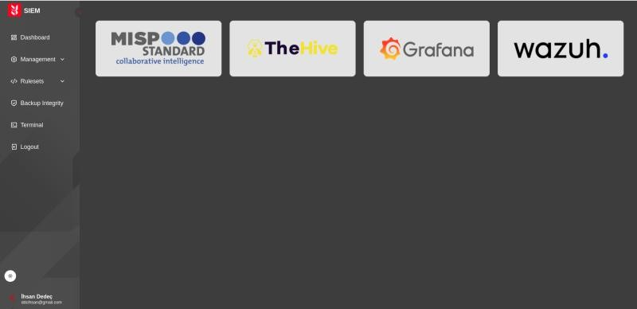
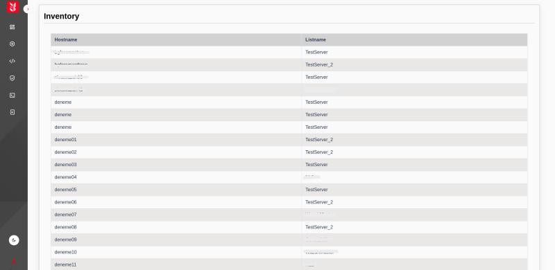
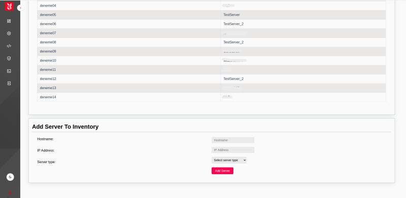
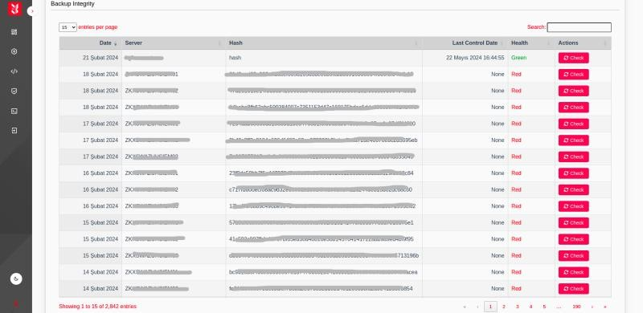
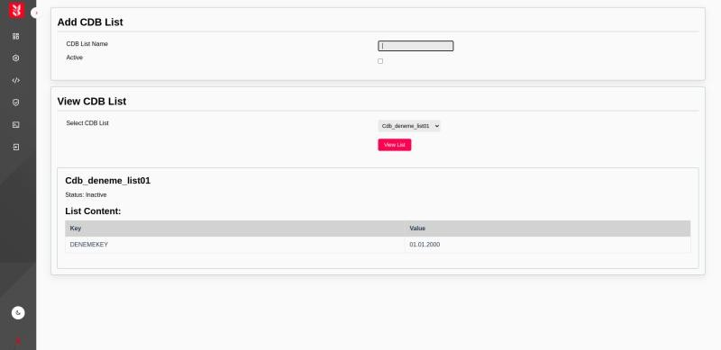
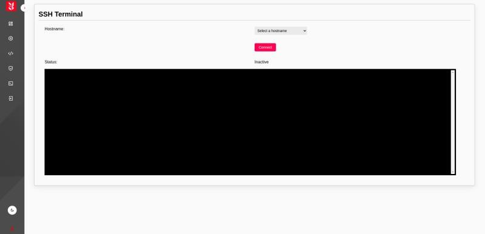
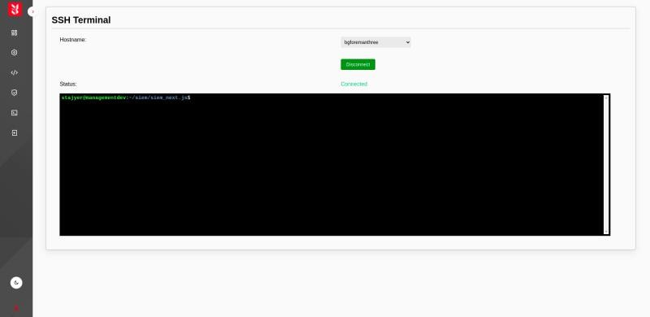

<h1> SIEM Dashboard Projesi </h1>

<h3> 📌 Proje Hakkında </h3>

SIEM panolarının etkin bir şekilde yönetilmesini sağlamak amacıyla geliştirilmiştir. Güvenlik olaylarının ve logların merkezi bir sistemde görüntülenmesi ve analiz edilmesi için modern bir arayüz sunar. Proje, güvenlik ekiplerinin iş süreçlerini optimize etmelerine ve olay yönetiminde daha hızlı aksiyon almalarına yardımcı olur.


<h3> 🛠 Kullanılan Teknolojiler </h3>

Backend: Django (RESTful API)

Frontend: Next.js

Veritabanı: PostgreSQL / MySQL (Seçime bağlı)

Kimlik Doğrulama: Keycloak

Diğer: SCSS, Docker 


 <h3>🚀 Özellikler </h3>

Kullanıcı dostu arayüz ile SIEM panolarının kolay yönetimi

Django REST API ile hızlı ve güvenilir veri işleme

Next.js ile dinamik ve modern bir kullanıcı deneyimi

Log ve güvenlik olaylarının merkezi bir sistemde görüntülenmesi ve analizi

Yetkilendirme ve kimlik doğrulama için Keycloak entegrasyonu


<h3> 📂 Kurulum </h3>

1️⃣ Depoyu Klonla
```bash
git clone https://github.com/ihsandedec/siem-nextjs-project.git
cd siem-nextjs-project
```

2️⃣ Backend Kurulumu (Django)
```bash
cd backend
python -m venv venv
source venv/bin/activate  # Windows için 'venv\Scripts\activate'
pip install -r requirements.txt
python manage.py migrate
python manage.py runserver
```

3️⃣ Frontend Kurulumu (Next.js)
```bash
cd frontend
npm install
npm run dev
```

 <h3> 🖥 Kullanım </h3>

Django API: http://127.0.0.1:8000

Next.js Frontend: http://localhost:3000


<h3> 📸 Ekran Görüntüleri </h3>














